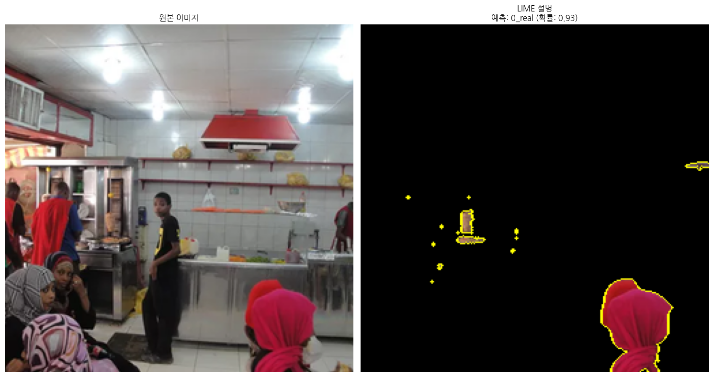

# 빅데이터 핀테크 딥러닝 프로젝트 7조

## XAI: AI vs REAL Image - Resnet34 + GradCam + paligemma3b fine tunning + LIME
### 김소현, 유지훈, 이하림, 최요한, 최지혜, 한규범

-----------------------------------------------------------------------

## 보완점
#### 교수님 피드백을 반영하여 GradCam 뿐 아니라 더 설명이 가능한 LIME plotting도 추가했습니다.
#### GradCAM: 마지막 합성곱 층이 예측 결과에 영향을 미친 정도
#### LIME: 입력 이미지가 예측 결과에 영향을 미친 정도
### 입력과 출력(마지막 합성곱층)에 대해서 모두 설명하므로 더욱 잘 설명한다고 할 수 있습니다.

-----------------------------------------------------------------------

## 결과 (3장의 이미지)

### 1번 이미지
#### ResNet34 -> GradCAM -> paligemma3b fine tunned

분류 결과: 실제 이미지

92.73% 확률로 진짜라고 판단되었으며, 상단 왼쪽 모서리에 있는 빛의 패턴과 질감에 주목했습니다.

#### LIME

상위 5개 중요 특징 (클래스 0_real):
1. 특징 256: 중요도 -0.0092
2. 특징 1: 중요도 -0.0090
3. 특징 108: 중요도 -0.0087
4. 특징 230: 중요도 -0.0082
5. 특징 215: 중요도 0.0075

### 2번 이미지
#### ResNet34 -> GradCAM -> paligemma3b fine tunned

분류 결과: 실제 이미지

99.50% 확률로 진짜라고 판단되었으며, 중앙의 밝은 빛과 그 주변의 어두운 부분에 집중하여 이 요소들의 비현실적인 조합을 판단 근거로 삼았습니다.

#### LIME

상위 5개 중요 특징 (클래스 0_real):
1. 특징 292: 중요도 -0.0122
2. 특징 256: 중요도 0.0114
3. 특징 302: 중요도 0.0111
4. 특징 273: 중요도 -0.0106
5. 특징 168: 중요도 -0.0089

### 3번 이미지
#### ResNet34 -> GradCAM -> paligemma3b fine tunned

분류 결과: AI 이미지

98.67% 확률로 가짜라고 판단되었으며, 상단 왼쪽 구석의 흰색 영역에 집중하여 이 요소의 특성과 질감을 판단 근거로 삼았습니다.

#### LIME

상위 5개 중요 특징 (클래스 1_fake):
1. 특징 57: 중요도 0.1056
2. 특징 124: 중요도 0.0861
3. 특징 40: 중요도 0.0780
4. 특징 73: 중요도 0.0681
5. 특징 72: 중요도 0.0603

---------------------------------------------------------------------------------------------------------------------

## 코드 파일 설명

#### AIandReal_rexnet150, cifake_vit -> 분류 모델 선정 전 비교하기 위해 훈련한 모델들입니다
#### Resnet34_v1 -> 최종 선정 후 훈련된 최종 분류 모델입니다
#### predict -> FineTunning 전 테스트 데이터에 대해 예측 및 전처리를 하는 과정입니다.
#### FineTunning-paligemma -> 만들어진 테스트 데이터 바탕으로 파인튜닝하는 과정입니다
#### Final -> 최종 시연 코드입니다

------------------------------------------------------------------------------------------------

## 데이터 구조 설명

#### readme_images -> 현재 파일인 README.md를 위한 이미지(결과)입니다
#### proposal_images -> 시연을 위한 이미지(훈련에 사용되지 않은)입니다

### dataset

- data: 분류 모델 Resnet34 훈련에 사용된 이미지(/train), 훈련된 모델(/model)
- test: 파인튜닝을 위한 테스트 데이터 이미지
- result: test 이미지를 resnet34로 분류한 결과
- gradcam: result에서 파인튜닝을 위해 gradcam만 떼어낸 데이터
- data.csv, data.xlsx : 최종 데이터인 data_answer_add를 생성하기 전 중간 과정 데이터입니다
- data_answer_add : Claude 3.5를 이용해서 데이터 증강으로 생성된 최종 데이터입니다
